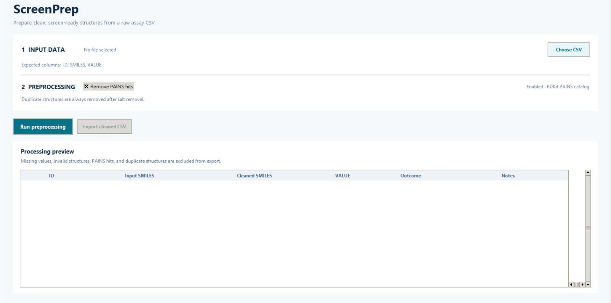
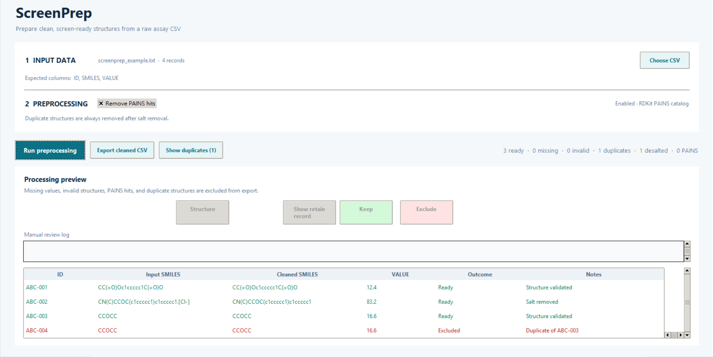

# ScreenPrep

A lightweight RDKit desktop GUI for cleaning raw data before proceeding with screening processes. It reads `ID`, `SMILES`, and `VALUE`, checks for missing values, validates each structure, removes counterion fragments, exclude duplicate structures, and optionally excludes Pan Assay Interference Compounds (PAINS) matches.

The output can be previewed and modified manually before exporting into a screening-ready CSV with the same three columns.

## Features

* Missing-value detection
* SMILES validation
* Salt removal
* Duplicate structure detection and reomval
* Optional PAINS filtering
* Manual review and modification
* CSV output

### Development note

Parts of this project were developed with assistance from AI coding tools. AI was used for code generation, debugging, refactoring, and implementation suggestions. The project structure, scientific workflow, methodology,and included code were reviewed and tested by the author.

## Setup

RDKit is most reliably installed from conda-forge:

```bash
conda create -n screenprep -c conda-forge python=3.11 rdkit
conda activate screenprep
python app.py
```

## Example input

```csv
ID,SMILES,VALUE
ABC-001,CC(=O)Oc1ccccc1C(=O)O,12.4
ABC-002,CN(C)CCOC(c1ccccc1)c1ccccc1.[Cl-],83.2
ABC-003,CCOCC,93.3
ABC-004,CCOCC,93.3
```

## Example output

*Assuming no manual modifications*
```csv
ID,SMILES,VALUE
ABC-001,CC(=O)Oc1ccccc1C(=O)O,12.4
ABC-002,CN(C)CCOC(c1ccccc1)c1ccccc1,83.2
ABC-003,CCOCC,93.3
```

The exported CSV includes only retained compounds and preserves the header order `ID,SMILES,VALUE`. Duplicate detection compares the canonical, desalted SMILES; the first occurrence is retained.

## Interface


